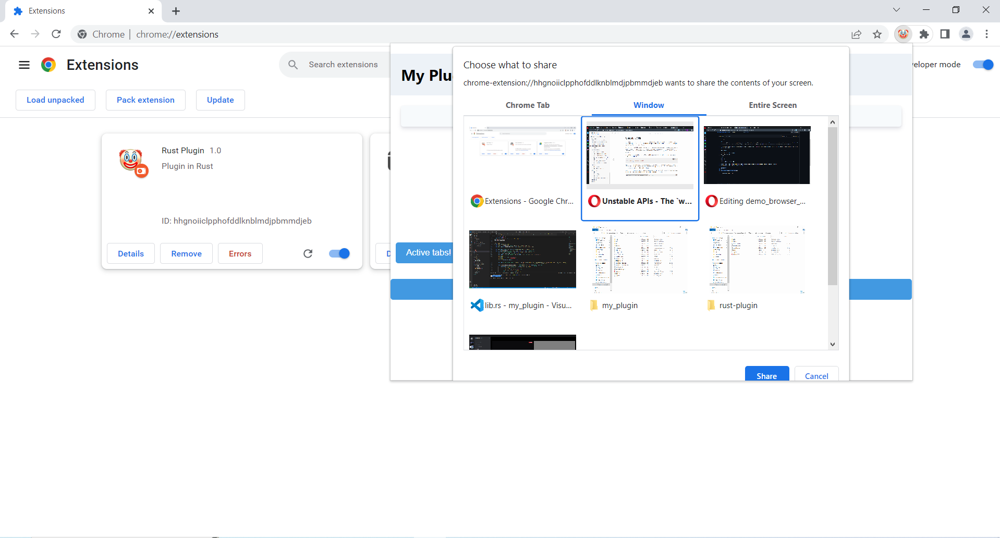

# Browser extension

## Abstract
In this project, I developed a simple Google Chrome extension that prints the URLs of all opened tabs of the browser in the extension HTML window, when the button of the extension is pressed. This extension also takes the screenshot of a selected file and displays this screenshot in the HTML window. Extension has a button to download the screenshot in the png file.
This extension was written in Rust and compiled to WASM to use the Rust functions in the Javascript module of the extension later. 

I used a `wasm-bindgen` crate to compile functions from Rust module into a wasm file. 
I also used a `web-sys` crate to get the information about the URLs of all opened tabs of the browser. With a help of the `web-sys` crate I also created a canvas to draw an image with the screenshot there.

## How to run

1. Install [Rust](https://rustup.rs/)
2. Install Wasm-pack
```bash
cargo install wasm-pack
```
3. Run the app
```bash
RUSTFLAGS=--cfg=web_sys_unstable_apis wasm-pack build --target web
```
4. Open Google Chrome browser and [install the extension](https://support.google.com/chrome_webstore/answer/2664769?hl=en)
5. Press the button to select the file to take screenshot

## Example

Here is an example of selecting a file to screen:


And the result screenshot in the file:

